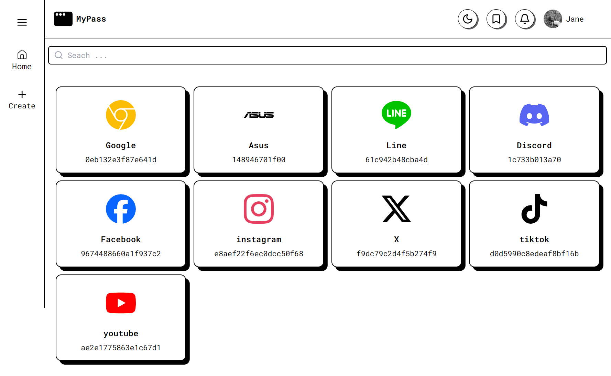

<h1 align="center">🔐Never Forget a Password Again: Build Your Own Secure Manager</h1>

## 📱 Screenshots

  

## ⚙️ Built with Amazing Tools

- [ReacJs](https://react.dev/) - The library for web and native user interfaces
- [MySQL](https://www.mysql.com/) - A popular open-source relational database management system for storing and managing data.
- [ExpressJs](https://expressjs.com/) - Fast, unopinionated, minimalist web framework for Node.js
- [Visual Studio Code](https://code.visualstudio.com/) - Code editing. Redefined.

## 🚀 Demo & Explanation 

Watch on my [Instagram](https://www.instagram.com/p/C81OlCXvqg8/).